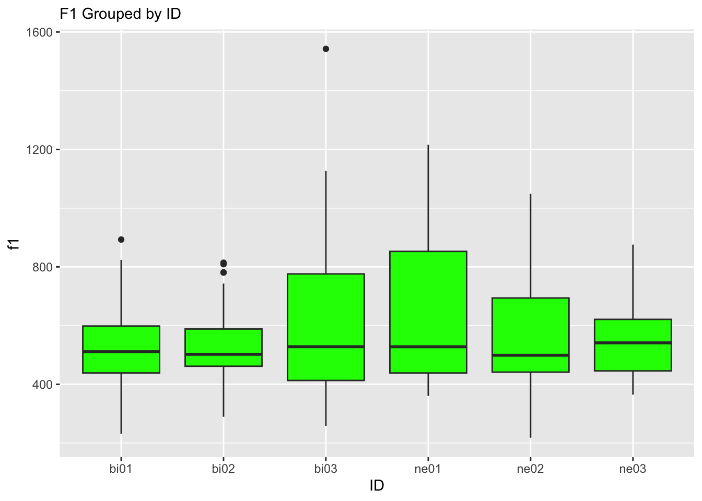
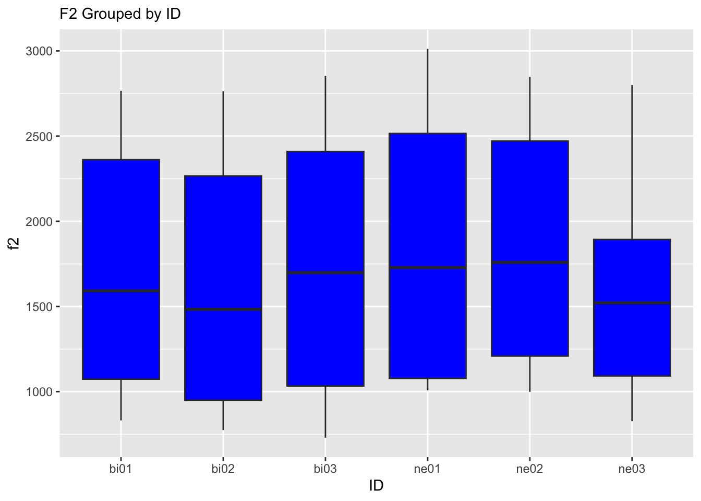
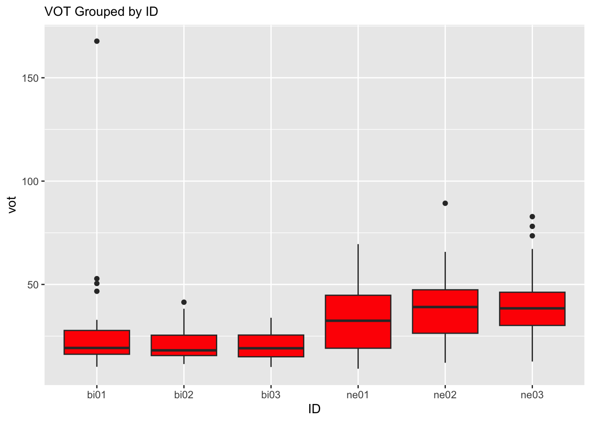
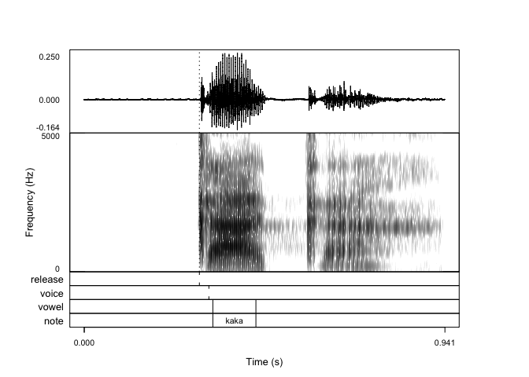

Programming assignment 4
================

**Author**: Jorge Vargas-Mutizabal **Date**: Last update: 2024-04-15
15:52:40.09065

# Overview

<!-- 
  &#10;-->

Los valores de VOT para los hablantes bilingüe serán más cortos que los
de los hablantes de español como segunda lengua. En cuanto a los valores
de F1 y F2, éstos serán mayores para los hablantes de español como L2
porque la vocal se proyecta con más intensidad, mientras que para los
hablantes bilingües, las formantes tendrán valores menores por la razón
contraria.

# Prep

## Libraries

``` r
library("tidyverse")
```

    ## ── Attaching core tidyverse packages ──────────────────────── tidyverse 2.0.0 ──
    ## ✔ dplyr     1.1.4     ✔ readr     2.1.5
    ## ✔ forcats   1.0.0     ✔ stringr   1.5.1
    ## ✔ ggplot2   3.4.4     ✔ tibble    3.2.1
    ## ✔ lubridate 1.9.3     ✔ tidyr     1.3.1
    ## ✔ purrr     1.0.2     
    ## ── Conflicts ────────────────────────────────────────── tidyverse_conflicts() ──
    ## ✖ dplyr::filter() masks stats::filter()
    ## ✖ dplyr::lag()    masks stats::lag()
    ## ℹ Use the conflicted package (<http://conflicted.r-lib.org/>) to force all conflicts to become errors

``` r
# Load libraries here
```

## Load data

``` r
# You need to get all the files in the 'data' directory and combine them
# Check previous examples we did in class 
data <- list.files(path="../data", full.names = TRUE) %>%
  lapply(read_csv) %>%
  bind_rows
```

    ## Rows: 45 Columns: 5
    ## ── Column specification ────────────────────────────────────────────────────────
    ## Delimiter: ","
    ## chr (2): fileID, notes
    ## dbl (3): f1, f2, vot
    ## 
    ## ℹ Use `spec()` to retrieve the full column specification for this data.
    ## ℹ Specify the column types or set `show_col_types = FALSE` to quiet this message.
    ## Rows: 45 Columns: 5
    ## ── Column specification ────────────────────────────────────────────────────────
    ## Delimiter: ","
    ## chr (1): fileID
    ## dbl (3): f1, f2, vot
    ## lgl (1): notes
    ## 
    ## ℹ Use `spec()` to retrieve the full column specification for this data.
    ## ℹ Specify the column types or set `show_col_types = FALSE` to quiet this message.
    ## Rows: 45 Columns: 5
    ## ── Column specification ────────────────────────────────────────────────────────
    ## Delimiter: ","
    ## chr (1): fileID
    ## dbl (3): f1, f2, vot
    ## lgl (1): notes
    ## 
    ## ℹ Use `spec()` to retrieve the full column specification for this data.
    ## ℹ Specify the column types or set `show_col_types = FALSE` to quiet this message.
    ## Rows: 45 Columns: 5
    ## ── Column specification ────────────────────────────────────────────────────────
    ## Delimiter: ","
    ## chr (1): fileID
    ## dbl (3): f1, f2, vot
    ## lgl (1): notes
    ## 
    ## ℹ Use `spec()` to retrieve the full column specification for this data.
    ## ℹ Specify the column types or set `show_col_types = FALSE` to quiet this message.
    ## Rows: 45 Columns: 5
    ## ── Column specification ────────────────────────────────────────────────────────
    ## Delimiter: ","
    ## chr (1): fileID
    ## dbl (3): f1, f2, vot
    ## lgl (1): notes
    ## 
    ## ℹ Use `spec()` to retrieve the full column specification for this data.
    ## ℹ Specify the column types or set `show_col_types = FALSE` to quiet this message.
    ## Rows: 45 Columns: 5
    ## ── Column specification ────────────────────────────────────────────────────────
    ## Delimiter: ","
    ## chr (1): fileID
    ## dbl (3): f1, f2, vot
    ## lgl (1): notes
    ## 
    ## ℹ Use `spec()` to retrieve the full column specification for this data.
    ## ℹ Specify the column types or set `show_col_types = FALSE` to quiet this message.
    ## Rows: 5 Columns: 1
    ## ── Column specification ────────────────────────────────────────────────────────
    ## Delimiter: ","
    ## chr (1): data
    ## 
    ## ℹ Use `spec()` to retrieve the full column specification for this data.
    ## ℹ Specify the column types or set `show_col_types = FALSE` to quiet this message.

## Tidy data

``` r
data2 <- data %>%
  separate("fileID", c("ID","Word")) %>%
  select(-c(notes,data)) %>%
  na.omit()

#| label: tidy-data
# Convert from long to wide or wide to long format as necessary (check 
# examples from class)
# Create any other relevant variables here 
```

# Analysis

## Descriptives

``` r
# Give some descriptive summaries of your data 
# Display your descriptives in a table (try knitr::kable())

means <- data2 |>
  group_by(ID)|>
  summarize(avg_f1 = mean(f1),
            sd_f1 = sd(f1),
            avg_f2 = mean(f2),
            sd_f2 = sd(f2),
            avg_vot = mean(vot),
            sd_vot = sd(vot))

knitr::kable(means)
```

| ID   |   avg_f1 |    sd_f1 |   avg_f2 |    sd_f2 |  avg_vot |    sd_vot |
|:-----|---------:|---------:|---------:|---------:|---------:|----------:|
| bi01 | 520.2511 | 138.3988 | 1727.237 | 666.6207 | 26.19733 | 23.572779 |
| bi02 | 520.4191 | 137.0234 | 1571.452 | 662.9699 | 21.16511 |  7.646880 |
| bi03 | 611.5304 | 260.5350 | 1748.093 | 699.7569 | 20.28844 |  6.785667 |
| ne01 | 621.9447 | 245.0054 | 1872.118 | 725.2815 | 34.03689 | 16.123838 |
| ne02 | 559.1331 | 210.9362 | 1857.418 | 643.2255 | 38.20467 | 16.827392 |
| ne03 | 561.0782 | 141.5530 | 1596.341 | 582.0208 | 39.93556 | 15.938874 |

## Visualization

``` r
# Include some plots here

data2 %>%
  ggplot() +
  aes(x = ID , y = f1 ) +
geom_boxplot(fill = "green") +
  labs(
    subtitle = "F1 Grouped by ID",
    x="ID",
    Y="F1")
```



``` r
data2 %>%
  ggplot() +
  aes(x = ID , y = f2 ) +
geom_boxplot(fill = "blue") +
  labs(
    subtitle = "F2 Grouped by ID",
    x="ID",
    Y="F2")
```



``` r
data2 %>%
  ggplot() +
  aes(x = ID , y = vot ) +
geom_boxplot(fill = "red") +
  labs(
    subtitle = "VOT Grouped by ID",
    x="ID",
    Y="VOT")
```



``` r
praatpicture::praatpicture("bi01_kaka.wav")
```

<!-- -->

## Hypothesis test

``` r
# Conduct a simple statistical analysis here (optional)
```

# Conclusion

<!-- 
Revisit your hypotheses (refer to plots, figures, tables, statistical tests, 
etc.)
&#10;Reflect on the entire process. 
What did you enjoy? What did you hate? What did you learn? 
What would you do differently?
-->

En concordancia con la hipótesis, el plot verde muestra que los valores
de F1 son mayores para los hablantes de L2. Sin embargo, para los
valores de F2, el plot azul muestra que los valores son mayores para
casi todos los hablantes de L2, menos para n03, cuyos valores son más
similares al de los hablantes bilingües. Por último, el plot rojo
muestra que los valores de VOT para los bilingües no superan los 50ms, y
para los hablantes de L2 bordean los 50 ms, lo que concuerda con
hipótesis.

El proceso del PA4 fue largo, pero muy productivo porque puedo usar
secciones del script 1 para cuando tenga que hacer el textgrid de muchos
archivos de sonido, y el 2 para cuando tenga que segmentar algo, y por
supuesto si es que alguna vez tuviere que hacer medición de VOT, ahora
tengo todas las herramientas para hacerlo. También, la tarea de buscar
el error en los scripts fue interesante porque me permitió entender
mejor cómo funcionan, y ahora tengo las herramientas para arreglar otros
en el futuro.

El proceso de R fue un poco más difícil porque aún es una herramienta
nueva para mí, pero creo que ahora pude entender mejor sus mecanismos, y
seguro van a ser muy útiles en el futuro. La tarea de hacer plots con
promedios me gustó mucho porque es aplicable a muchas tareas en la que
necesitemos observar patrones. </br></br>
